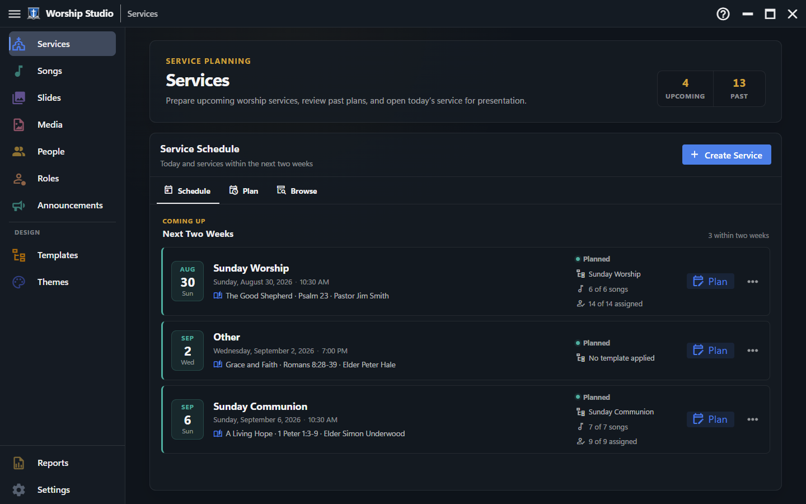

<div align="center">


**Plan a church service and present it live, from one place.**

[Try the demo](https://jeyeager65.github.io/WorshipStudio/app/?demo=1) ·
[Help site](https://jeyeager65.github.io/WorshipStudio/) ·
[Download](https://github.com/jeyeager65/WorshipStudio/releases)

</div>

Your library is **plain JSON files in a folder you already sync** — Dropbox, OneDrive, whatever
you use. There is no server, no database, and no account: nothing sits between your church and
its own files, and nothing stops working if this project does. The same folder backs a Windows
app, any browser, and a tablet.

Build the order of worship — songs, scripture, slides, media, announcements, the sermon — and
the same screen runs it on Sunday, stepping through every slide in order. No exporting, no second
program, no rebuilding the same service in two tools.



## What it does

- **Plan and present from one workspace** — build the order of worship from a reusable
  [service template](https://jeyeager65.github.io/WorshipStudio/service-templates.html), then run
  it live with Next/Previous, Blank Screen and Background Only, and a readiness check that flags
  anything not ready to present.
- **Song and slide libraries** built once and reused weekly, with OpenSong import and Canva.
- **Scripture** in KJV out of the box; ESV and NIV with a key. Long passages split themselves
  across slides at verse boundaries.
- **Presentation themes** applied per content type, so scripture and songs can look different
  without styling either by hand.
- **People and roles** — who is serving each week, with double-booking and availability conflicts
  caught automatically.
- **Bulletins and reports** generated from the same service you already planned — printable order
  of worship, song usage with CCLI numbers, multi-week planning views.
- **Remote control** from a phone or tablet, and hand-off to an external app mid-service.
- **One library, three ways in** — the Windows app for the machine driving the screen, any
  browser for planning, and an installable tablet PWA. All three work against the same synced
  folder, and all three can present.

See the [help site](https://jeyeager65.github.io/WorshipStudio/) for a full walkthrough of every
area of the app.

## Status

Feature-complete for the v1 roadmap, and still pre-1.0: under active development, with
interfaces and file formats not yet frozen between releases. See
[notes/architecture-plan.md](notes/architecture-plan.md) for the milestone breakdown.

One known gap: the **Dropbox** side of the cloud connection — the one a tablet or a Mac on
Safari uses — is implemented but has never been exercised against the live API. OneDrive is the
tested path.

The desktop app checks for updates and prompts before installing anything. Only a *published*
release is ever offered, so drafts stay invisible to installed machines.

## Contributing

**Pull requests aren't being accepted before 1.0** — there's enough to coordinate already. Please
don't spend time on one that won't be merged.

**Issues are very welcome**, especially from anyone actually running a service with it:
[open one here](https://github.com/jeyeager65/WorshipStudio/issues). See
[CONTRIBUTING.md](CONTRIBUTING.md) for the longer version.

## License

[MIT](LICENSE) — your library is plain files on disk regardless, so nothing here can strand you.

## For developers

Four backends implement one `StudioAdapter` interface (`src/adapters/types.ts` — the authoritative
list of what each port does): `tauri` (the desktop app), `web` (File System Access), `tablet`
(the cloud-synced PWA), and `mock` (the browser demo and local dev fixtures). Adding a feature
usually means adding to that interface and then to each backend that can support it.

Design notes and decision records live in [notes/](notes/) — start with
[notes/README.md](notes/README.md), which says which to read and in what order.

## Stack

Vue 3 + TypeScript + Vuetify 4, Pinia, vue-router, Vite, Tauri v2 (Rust). See the architecture
doc for the full rationale, the adapter-based frontend/backend split, and the milestone plan.

## Requirements

- Node.js ≥ 24.11.1 (Vuetify 4's floor). The exact version is in [`.nvmrc`](.nvmrc), which CI and
  `nvm`/`fnm` both read — no second place to keep in step.
- pnpm — `corepack enable` picks up the version pinned in `package.json`'s `packageManager`
- Rust stable + Cargo, for the desktop shell (`src-tauri/`)

## Getting started

```sh
pnpm install

# Browser only, no Tauri — prompts to open a real library folder (the web adapter) or try the
# demo (the mock adapter); also the static demo build target
pnpm dev

# Full desktop app, real Tauri backend
pnpm tauri dev
```

## Scripts

| Command | What it does |
| --- | --- |
| `pnpm dev` | Vite dev server, browser only — real web adapter or the mock demo, your choice at launch |
| `pnpm tauri dev` | Full desktop app against the real Rust backend |
| `pnpm build` | Type-checks, then builds `dist/` — the same output used by the Tauri bundle and the static demo |
| `pnpm preview` | Serves a built `dist/` locally |
| `pnpm type-check` | `vue-tsc`, no emit |
| `pnpm lint` | ESLint, auto-fixing |
| `pnpm format` | Prettier, writes `src/` |
| `pnpm test:unit` | Vitest — frontend unit tests |
| `pnpm build:remote` | The Remote Control mirror's separate bundle (`src-remote/`), embedded into the Rust binary |
| `pnpm build:pages` | Help site + app assembled into `pages/` — what the dev deployment publishes |
| `pnpm docs:dev` / `docs:build` | The VitePress help site |

End-to-end tests live in `e2e/` and are run by hand, not in CI (they need a real desktop session).
From `e2e/`: `npm run build:app` — mandatory, the binary bundles the built frontend — then
`npm test`. See [notes/release-process.md](notes/release-process.md), which makes this a release
step.

Rust side (`src-tauri/`): `cargo fmt`, `cargo clippy --all-targets -- -D warnings`, `cargo test`
— all three run in CI (`.github/workflows/ci.yml`) alongside the frontend checks above.

## Project layout

```
src/                    Vue app — shared between the Tauri build and the static demo build
  adapters/             The UI/backend boundary
    types.ts            One interface every backend implements; the source of truth for what
                         each port (songs, services, slides, settings, displays, live, media,
                         remote, sync, email, ...) does and whether it's optional/feature-detected
    tauri/               Real desktop implementation, calling into src-tauri/ via invoke()
    web/                 File System Access implementation — same synced folder, from a browser
    tablet/              OPFS-cached implementation synced directly to Dropbox/OneDrive (PWA)
    mock/                Browser/localStorage-backed implementation (demo + local dev)
  models/                TypeScript types for the JSON data (songs, services, slides, settings)
  stores/                Pinia stores
  views/                 Screens (routed pages)
  components/            Shared/reusable components
  utils/                 Pure helper functions (scripture references, service flattening, ...)
  router/                vue-router routes + the unsaved-changes navigation guard
  plugins/               Vuetify setup (themes, icons)
src-remote/              The Remote Control mirror's own small Vue bundle, served by the Rust
                         HTTP server to a paired phone — built separately (build:remote)
e2e/                     WebdriverIO suite driving the real desktop binary, plus the scripts that
                         capture the help site's screenshots and the overview video
src-tauri/               Rust backend
  src/commands/          Thin Tauri command wrappers (#[tauri::command])
  src/domain/            Pure logic the commands call into, unit-tested independent of Tauri
  src/models.rs          Rust-side mirror of the JSON data shapes (serde)
  src/paths.rs            Where the synced library folder lives on disk
  icons/                 App icons for every platform Tauri bundles for
notes/                   Architecture and release-process planning docs
docs/                    VitePress help site (in-app + GitHub Pages landing page) — see notes/help-system-plan.md
scripts/release/         Windows code-signing certificate + one-time machine-trust script
.github/workflows/       CI (pushes to main/dev and every PR; also deploys dev to Cloudflare)
                         and Release (on a vX.Y.Z tag push, refused unless the tag is on main)
```

## Releases

Tagged releases (`vX.Y.Z`) build a Windows installer, signed with a self-signed certificate — a
paid CA certificate isn't realistic for a free, open-source project — and republish the GitHub
Pages site (the VitePress help site as the landing page, the static browser demo nested at
`/app/`). Each machine trusts that certificate once
(`scripts/release/install-trust-windows.ps1`); every release after that installs without a
publisher warning — see [notes/release-process.md](notes/release-process.md) for the full setup
and release flow.
